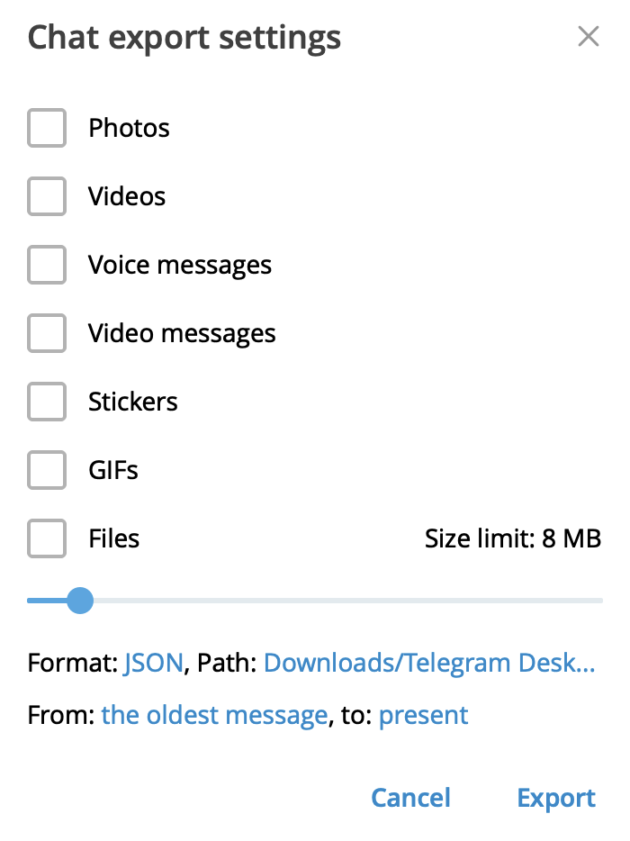

# 🦒💨 Жираф - Сокрушитель Спама: бот для борьбы со спамом в Telegram

## 🤔 Что это такое?

Жираф - Сокрушитель Спама - это бот для Telegram, который в пол копыта борется со спамом в каналах и группах. Он использует передовой искусственный интеллект, чтобы выявлять и уничтожать спам. Да, мы знаем, что жирафы не славятся своей борьбой со спамом, но наш - особенный!

## 🚀 Что умеет наш Жираф?

- 🧠 Анализирует сообщения с помощью умных систем OpenAI или Anthropic (спойлер: он умнее, чем кажется!)
- 💾 Ведёт учёт пользователей, чтобы не проверять всех подряд (даже жирафы умеют считать)
- 🎛️ Настраиваемая чувствительность к спаму (от "божья коровка" до "разъярённый носорог")
- 📜 Работает с историей сообщений в существующих группах (у него отличная память, в отличие от некоторых)
- 🎯 Возможность фокусироваться на определённых каналах (потому что даже жирафу нужен перерыв)
- 📊 Детальная статистика работы (для тех, кто любит цифры больше, чем мемы)

## 🛠️ Как работает Сокрушитель Спама?

1. 👀 **Наблюдает за новичками:** Проверяет сообщения только от новых участников. Старожилы могут расслабиться!
2. 🔍 **Умный анализ:** Использует ИИ для точного определения спама. Почти как настоящий жираф, только умнее.
3. 🔧 **Гибкая настройка:** Вы решаете, насколько строгим должен быть бот. От "добрый жираф" до "беспощадный охотник на спам".
4. 🛡️ **Активная защита:** Удаляет спам или помечает подозрительные сообщения. Спамеры будут плакать!
5. 🕰️ **Работа с историей:** Может проанализировать прошлые сообщения в группе. Да, у него машина времени!
6. 📋 **Следует вашим правилам:** Работает только там, где вы укажете. Он послушный, в отличие от некоторых домашних питомцев.

## 📥 Как установить Сокрушителя Спама?

1. Скачайте файлы бота (не волнуйтесь, он не весит как настоящий жираф):
   ```
   git clone https://github.com/ailabhub/giraffe-spam-crasher.git
   cd giraffe-spam-crasher
   ```

2. Настройте бота (требуется магическое заклинание... или просто создайте файл `.env`):
   ```
   TELEGRAM_BOT_TOKEN=ваш_токен_бота
   OPENAI_API_KEY=ваш_ключ_openai
   ANTHROPIC_API_KEY=ваш_ключ_anthropic
   HISTORY=/root/result.json
   PROMPT=/root/prompt.txt
   MODEL=claude-sonnet-4-5
   PROVIDER=anthropic
   SPAM_THRESHOLD=0.6
   NEW_USER_THRESHOLD=1
   WHITELIST_CHANNELS=
   LOG_LEVEL=info
   ```
   Не забудьте заменить значения на свои. Жираф умеет читать, но не умеет угадывать.

3. При первом запуске экспортируйте историю чата в файл results.json
   


## 🚀 Как запустить Жирафа?

Убедитесь, что у вас установлены Docker и Docker Compose. Затем:

1. 🏁 Запустите бота (он не умеет бегать, зато умеет летать в контейнере):
   ```
   docker-compose up -d
   ```

2. 👁️ Следите за работой (спойлер: это увлекательнее, чем смотреть, как сохнет краска):
   ```
   docker-compose logs -f bot
   ```

3. 🛑 Чтобы остановить (но зачем? он только разогрелся!):
   ```
   docker-compose down
   ```

## ⚙️ Тонкая настройка Сокрушителя

В файле `.env` можно настроить (только не перестарайтесь, а то он станет умнее вас):

- 📜 `HISTORY`: файл экспортированной истории телеграм канала — для идентификации "старых" пользователей (да, ты уже старый) 
- 📝 `PROMPT`: файл с промптом, теги как в примере — нужны! 
- 🤖 `MODEL`: выбор модели ИИ (от "умненький жираф" до "суперкомпьютер в шкуре жирафа") 
- 🏢 `PROVIDER`: OpenAI или Anthropic (выбирайте с умом, жираф не любит менять провайдеров, но антропик+соннет лучше для промпта в примере)
- 🎚️ `SPAM_THRESHOLD`: уровень чувствительности к спаму (от 0 до 1, где 1 - "пропускать все", а "0" — все сообщения — спам)
- 🔢 `NEW_USER_THRESHOLD`: после какого количества сообщений новый пользователь перестает проверяться (1 — пока вполне норм)
- 📢 `WHITELIST_CHANNELS`: список разрешённых каналов (для VIP-жирафов)
- 📊 `LOG_LEVEL`: детальность логов (от "молчаливый жираф" до "жираф-болтун")
- 📋 `LOG_CHANNELS`: Пары ID рабочих чатов и ID их каналов логов (через запятую)

При использовании Docker вы можете установить эти настройки в файле `.env` или передать их напрямую в контейнер вашего жирафа. Удачного укрощения жирафов!

## 🧩 Архитектура Жирафа

Наш Сокрушитель Спама состоит из трёх ключевых модулей (да, у жирафа есть архитектура!):
- 🧠 `ai`: мозговой центр, общающийся с ИИ (умнее, чем кажется)
- 🤖 `bot`: интерфейс взаимодействия с Telegram (дружелюбнее, чем настоящий жираф)
- 📚 `history`: загрузка данных о прошлых сообщениях (память как у слона, только лучше)

## 🤝 Хотите помочь в развитии?

У вас есть идеи по улучшению Жирафа - Сокрушителя Спама? Мы открыты для предложений! Создавайте issues или отправляйте pull requests на GitHub. Только не кормите его с рук, он на диете.

## 📄 Лицензия

Жираф - Сокрушитель Спама распространяется под лицензией MIT. Кратко: вы можете свободно использовать, изменять и делиться этим ботом, главное - указывать авторство и сохранять текст лицензии в коде. И нет, вы не можете использовать его для создания армии роботов-жирафов.

```
MIT License

Copyright (c) 2024 AILabHub

[Полный текст лицензии, который никто никогда не читает, но он очень важный]
```
